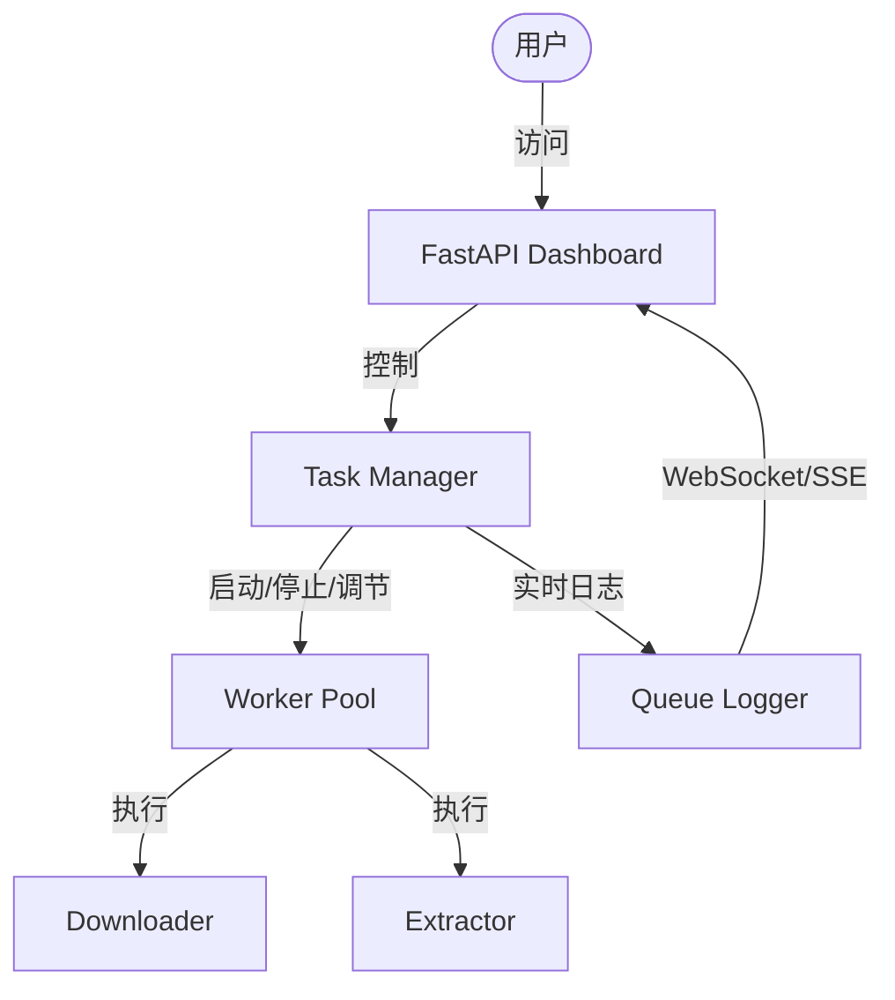

# Implementation Plan: FastAPI Dashboard & Parallel Task Manager

## 1. 架构概览

我们将引入一个基于 FastAPI 的 Web 界面，用于实时监控 IPO 招股书的抓取和解析进度。核心组件包括：

- **Task Manager (`src/task_manager.py`)**: 负责协调下载和提取任务。它将管理一个进程池/线程池，并允许动态调整并发数。
- **Web Dashboard (`src/web_dashboard.py`)**: 提供 REST API 和 WebSocket/SSE 接口，用于前端显示。
- **Frontend (`src/templates/index.html`)**: 使用 Tailwind CSS 和原生 JavaScript 构建的单页仪表盘。

## 2. 详细设计

### 2.1 依赖项更新
在 `requirements.txt` 中添加：
- `fastapi`
- `uvicorn`
- `jinja2`
- `python-multipart`

### 2.2 Task Manager (`src/task_manager.py`)
- **状态管理**: 记录当前总任务数、已完成数、失败数、当前并发数。
- **并发控制**: 使用 `multiprocessing.Pool` 或 `concurrent.futures`。支持运行时通过 API 调整 `max_workers`。
- **日志捕获**: 实现一个自定义的 Logging Handler，将日志推送到队列中，供 Web 界面消费。

### 2.3 Web Dashboard (`src/web_dashboard.py`)
- **Endpoint `/`**: 渲染主页。
- **Endpoint `/api/status`**: 返回当前进度和统计信息。
- **Endpoint `/api/config` (POST)**: 更新并发数等配置。
- **Endpoint `/ws/logs`**: WebSocket 连接，实时推送系统日志。

### 2.4 Launcher 集成 (`src/launcher.py`)
- 修改 `launcher.py` 以支持 `--web` 模式。
- 如果启用 Web 模式，将启动 `uvicorn` 服务器，并自动在浏览器中打开 Dashboard。

## 3. 待办事项 (TODO)

- [ ] 更新 `requirements.txt`。
- [ ] 编写 `src/task_manager.py` 实现核心调度逻辑。
- [ ] 编写 `src/web_dashboard.py` 及 HTML 模板。
- [ ] 重构 `src/main.py` 以适配 `TaskManager` 调用。
- [ ] 修改 `src/launcher.py` 增加 Web 启动入口。

## 4. 交互流程

1. 用户运行 `python src/launcher.py --web`。
2. 启动 FastAPI 后端，默认端口 8000。
3. 浏览器自动打开 `http://127.0.0.1:8000`。
4. 用户在界面上点击 "开始任务"，并可随时滑动手块调整并发线程/进程数。
5. 界面下方的日志窗口实时滚动显示处理详情。
